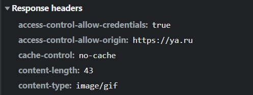
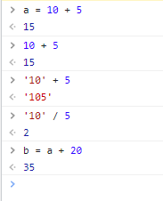

#Лабораторная работа №2

[Яндекс](ya.ru)

<ul>
    <li>Request URL</li>
    Адрес, куда отправляется информация из формы, состоит из HTTP метода, URL, URI ресурса.
    <li>Request Method</li>
    Указывают, какое желаемое действие выполнится для данного ресурса.
</ul>

>Существуют методы: GET, HEAD, POST, PUT, DELETE, CONNECT, OPTIONS, TRACE, PATCH.

    GET - запрашивает ресурс, используется для извлечения данных.
    HEAD - запрашивает ресурс также, как метод GET, но без тела ответа
    POST - используется для отправки сущностей ресурсу.

<ul>
    <li>Status Code</li>
    Указывает на успешность выполнения запроса. 
    Делится на 5 групп:  
        1. Информационные 100 - 199 
        2. Успешные - 200 - 299 
        3. Перенаправления 300 - 399 
        4. Клиентские ошибки 400 - 499 
        5. Серверные ошибки 500 - 599 
        Например, 200 - "Успешно", запрос успешно обработан;  
        301 - "Перемещен на постоянной основе", URI запрашиваемого ресурса был изменен.
        <li>Remote Address</li>
        Состоит из IP-адреса ресурса и порта. Обычно для подключения по HTTP порт - 80, а для HTTPS - 443.
        Например, в данном примере 5.255.255.80:443
        <li>Referrer Policy</li>
         Referrer Policy - это HTTP Response Header. Он может содержать одно из значений:
    <ul>
        <li>""</li>
        <li>"no-referrer"</li>
        <li>"no-referrer-when-downgrade"</li>
        <li>"same-origin"</li>
        <li>"same-origin"</li>
        <li>"strict-origin"</li>
        <li>"origin-when-cross-origin"</li>
        <li>"strict-origin-when-cross-origin"</li>
        <li>"unsafe-url"</li>
    </ul>
</ul>
    Пустая строка означает, что сайт не хочет устанавливать значение заголовка. Браузер может выбрать заголовок на основании, например, meta элемента в HTML, или атрибута referrerpolicy на элементах типа a и link, или на ключе rel="noreferrer" на элементе a.
    "no-referrer" говорит браузеру никогда не слать заголовок referer для запросов с сайта.
    "origin" - браузер всегда отображает в referer только сайт, откуда пришел запрос. Всю дополнительную информацию из URL он вырезает.

<ul>
    <li>content-type</li>
        Определяет Mime-тип ресурса - строка, отправляемая вместе с файлом, которая указывает тип файла.  (например, передаваемый аудиофайл может быть помечен как audio/ogg тип, а изображение - image/png)
    <li>cache-control</li>
        <ul>
        Общий заголовок Cache-Control используется для задания инструкций кеширования как для запросов, так и для ответов. 
        <li>public Указывает, что ответ может быть закеширован в любом кеше.  </li>
        <li>private указывает, что ответ предназначен для одного пользователя и не должен помещаться в разделяемый кеш. Частный кеш может хранить ресурс.  </li>
        <li>no-cache Указывает на необходимость отправить запрос на сервер для валидации ресурса перед использованием закешированных данных.  </li>
        <li>only-if-cached Указывает на необходимость использования только закешированных данных. Запрос на сервер не должен посылаться.  </li>
        </ul>
    <li>cookie</li>
    Небольшой фрагмент данных, который сервер отправляет браузеру пользователя. Браузер может сохранить этот фрагмент у себя и отправлять на сервер с каждым последующим запросом. С помощью кук можно сохранить любую информацию о состоянии.
    <li>user-agent</li>
    Строка с характеристиками, по которым сервера и сетевые узлы могут определить тип приложения, операционную систему, производителя и версию пользовательского агента.
    Пользовательский агент - программа, представляющая пользователя и выполняющая действия от его лица. Например, веб-браузер.
    <li>referer</li>
        Заголовок Referer позволяет понять, откуда пришли пользователи. Он содержит адрес, с которого пришел запрос.
</ul>

Remote Address состоит из IP-адреса сервера и порта.
Порт подключения - число, указываемое при запросе на соединение. Для установки соединения протоколу необходимы:
<ul>
    <li>Номер протокола</li>
    <li>IP-адреса отправителя и получателя</li>
    <li>Номера портов процесса-отправителя и получателя</li>
</ul>

Заголовки разделены на General, Response и Request.

Request Header используется в HTTP-запросе и не используется относится к содержимому сообщения. Заголовки запроса, такие как Accept, Accept-* или If-* позволяют выполнять условные запросы; другие, такие как Cookie, User-Agent или Referer уточняют контекст, чтобы сервер мог адаптировать ответ.

Response Header используются в ответе и не относятся к содержимому сообщения. Заголовки ответа, такие как Age, Location, Server используются чтобы дать более детальный контекст ответа.

Повторяются заголовки content-length, content-type. Запрос и ответ могут отличаться по типу и длине.

Тело запроса — это информация, которую передал браузер при запросе страницы. Но тело запроса присутствует только если браузер запросил страницу методом POST. Например, если отправлена форма, то телом запроса будет содержание формы.

При попытке связаться с сайтом http://rgups.ru заголовок Status Code вернул 301. Произошло перенаправление на сайт с протоколом https, для этого потребовался один запрос. Адрес изменился на https://rgups.ru/.

Все куки, используемые на странице, можно посмотреть во вкладке Application -> Storage -> Cookies
Среди атрибутов есть:
<ul>
    <li>Name - название файла Cookie</li>
    <li>Value - значение файла</li>
    <li>Domain - уточняет, какие хосты могут получать Cookie. Если сервер не уточняет, то браузер использует тот же домен, что и у хоста.</li>
    <li>Path - устанавливает URL, который должен быть в запрашиваемом URL, чтобы отправить Cookie заголовок</li>
    <li>Expires - определяет срок жизни файла Cookie</li>
</ul>

Cookie предназначены для сохранения пользовательской информации на сайте для дальнейшего удобства пользования. В нем сохраняются некоторые введенные данные, установленные настройки, информация о посещении сайта.  
DOM - структурированное представление документа, в виде группы узлов и объектов, которые имеют свойства и методы. Теги являются узлами и формируют структуру документа. Благодаря нему можно связать веб-страницу с языками программирования. 

Итоговый документ может отличаться от тела ответа, полученного от сервера, так как DOM может редактироваться языками программирования во время работы.

Браузер запрашивает различные медиа-данные для документа, например изображения, исполняет скрипты, например загрузку данных из кеша памяти.

Операции в js в Console:
